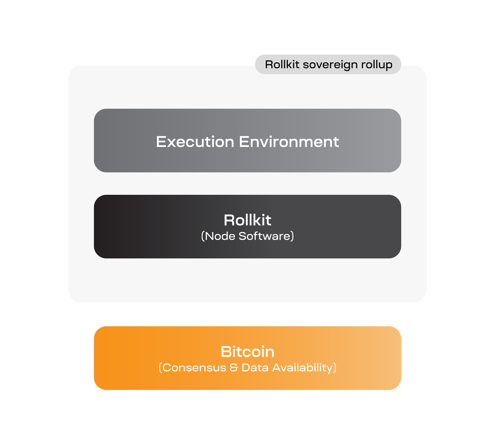

# Bitcoin rollup tutorial

## Introduction

In this tutorial, we will explore how to use Rollkit to create sovereign rollups on Bitcoin. First, we will install Bitcoin Core to run a local testnet. Then, we will install and set up a Rollkit node to work with Bitcoin as a data availability layer. Lastly, we'll look at how to create a custom EVM execution environment and how to deploy a sovereign rollup on Bitcoin using Rollkit.

By the end of this tutorial, you will have a good understanding of how Rollkit works and how to create sovereign rollups on Bitcoin using Rollkit. You will also have the knowledge and skills needed to customize Rollkit with different execution environments and data availability layers, opening up new possibilities for creating scalable and efficient blockchain applications.

Read more in our [blog post](../../../blog/sovereign-rollups-on-bitcoin).



### The bitkit stack

Sovereign rollups on Bitcoin are made possible through a module that allows Rollkit rollups to use Bitcoin for data availability. This integration opens up possibilities for developers to create rollups with arbitrary execution environments that inherit Bitcoin’s data availability guarantees and security guarantees.

The Taproot upgrade and [Ordinals](https://ordinals.com/) usage of Bitcoin for publishing arbitrary data made it possible to integrate Bitcoin as a data availability layer into Rollkit. The modular design of Rollkit allows for easy integration of new data availability layers, making it possible to deploy sovereign rollups on Bitcoin.

The goal of Rollkit is to make it easy to build and customize rollups, enabling developers to build sovereign rollups on Bitcoin or customize Rollkit with different execution environments and data availability layers.

## Prerequisites

An Ubuntu machine with:

- 8GB RAM
- 160 GB SSD
- Ubuntu 22.10
- 4 core AMD CPU

## Setup

### Install Bitcoin

Running the rollup requires a local regtest Bitcoin node. You can set this up by running the following commands.

Update the apt database repository:

```bash
sudo apt update
```

Install `snapd` and `make` on your system:

```bash
sudo apt install snapd make
```

Install Bitcoin Core:

```bash
sudo snap install bitcoin-core
```

Check version:

```bash
bitcoin-core.cli --version
```

Set up the config for the regtest (local network):

```bash
bitcoin-core.daemon "-chain=regtest" "-rpcport=18332" "-rpcuser=rpcuser" "-rpcpassword=rpcpass" "-fallbackfee=0.000001" "-txindex=1"
```

Set up the config for the chain:

```bash
bitcoin-core.cli -regtest -rpcport=18332 -rpcuser=rpcuser -rpcpassword=rpcpass createwallet w1
```

Your output will look like:

```console
{
  "name": "w1",
  "warning": ""
}
```

Add this script and remember where you placed it, I am putting it in my root directory:

```shell
# Script to generate a new block every minute
# Put this script at the root of your unpacked folder
#!/bin/bash

echo "Generating a block every minute. Press [CTRL+C] to stop.."

address=`bitcoin-core.cli -regtest -rpcport=18332 -rpcuser=rpcuser -rpcpassword=rpcpass getnewaddress`

while :
do
        echo "Generate a new block `date '+%d/%m/%Y %H:%M:%S'`"
        bitcoin-core.cli -regtest -rpcport=18332 -rpcuser=rpcuser -rpcpassword=rpcpass generatetoaddress 1 $address
        sleep 5
done
```

I put my script in `~/generateblocks.sh` and need to give it permissions to run:

```bash
chmod +x ~/start.sh
```

Start generating blocks:

```bash
bash start.sh
```

Check the current block height:

```bash
bitcoin-core.cli -regtest -rpcport=18332 -rpcuser=rpcuser -rpcpassword=rpcpass getblockcount
```

Your output will look similar to below:

```bash
4980
```

Set a variable for the common flags being used:

```bash
export FLAGS="-regtest -rpcport=18332 -rpcuser=rpcuser -rpcpassword=rpcpass"
```

Check the latest block hash:

```bash
bitcoin-core.cli $FLAGS getblockhash 4980
```

Your output will be the block hash of the height you first queried:

```bash
1d7e98aec3085b615c7c71659768fa42e774a87ab5981597e99794d240fb3db5
```

Now to get the block header, run the following command (be sure to replace the hash with yours):

```bash
bitcoin-core.cli $FLAGS getblockheader 1d7e98aec3085b615c7c71659768fa42e774a87ab5981597e99794d240fb3db5
```

Now to finish the exercise, query the height from the block header and the hash:

```bash
bitcoin-core.cli $FLAGS getblockheader 1d7e98aec3085b615c7c71659768fa42e774a87ab5981597e99794d240fb3db5 | jq '.height'
```

### Install Golang

```bash
ver="1.19.1"
cd $HOME
wget "https://golang.org/dl/go$ver.linux-amd64.tar.gz"
sudo rm -rf /usr/local/go
sudo tar -C /usr/local -xzf "go$ver.linux-amd64.tar.gz"
rm "go$ver.linux-amd64.tar.gz"
echo "export PATH=$PATH:/usr/local/go/bin:$HOME/go/bin" >> $HOME/.bash_profile
source $HOME/.bash_profile
go version
```

### Install Ignite CLI

```bash
curl https://get.ignite.com/cli! | bash
```

Check version:

```bash
ignite version
```

Scaffold the chain:

```bash
ignite scaffold chain hello
```

Change into `hello` directory:

```bash
cd hello
```

## Install Rollkit

```bash
go mod edit -replace github.com/cosmos/cosmos-sdk=github.com/rollkit/cosmos-sdk@v0.46.7-rollmint-v0.5.0-no-fraud-proofs.0.20230302215518-6f11f14d9ba3
go mod edit -replace github.com/tendermint/tendermint=github.com/rollkit/tendermint@v0.34.22-0.20230301013318-10369c684a5c
go mod tidy
go mod download
```

<!-- Download the script to start the rollup:

```bash
# after script is live
``` -->

## Start the rollup

Add this `init.sh` script to the `hello` directory:

```shell
#!/bin/sh

# set variables for the chain
VALIDATOR_NAME=validator1
CHAIN_ID=hello
KEY_NAME=hello-key
KEY_2_NAME=hello-key-2
CHAINFLAG="--chain-id ${CHAIN_ID}"
TOKEN_AMOUNT="10000000000000000000000000stake"
STAKING_AMOUNT="1000000000stake"

# create a random Namespace ID for your rollup to post blocks to
NAMESPACE_ID=$(echo $RANDOM | md5sum | head -c 16; echo;)
echo $NAMESPACE_ID

# build the hello chain with Rollkit
ignite chain build

# reset any existing genesis/chain data
hellod tendermint unsafe-reset-all

# initialize the validator with the chain ID you set
hellod init $VALIDATOR_NAME --chain-id $CHAIN_ID

# add keys for key 1 and key 2 to keyring-backend test
hellod keys add $KEY_NAME --keyring-backend test
hellod keys add $KEY_2_NAME --keyring-backend test

# add these as genesis accounts
hellod add-genesis-account $KEY_NAME $TOKEN_AMOUNT --keyring-backend test
hellod add-genesis-account $KEY_2_NAME $TOKEN_AMOUNT --keyring-backend test

# set the staking amounts in the genesis transaction
hellod gentx $KEY_NAME $STAKING_AMOUNT --chain-id $CHAIN_ID --keyring-backend test
hellod gentx $KEY_2_NAME $STAKING_AMOUNT --chain-id $CHAIN_ID --keyring-backend test

# collect genesis transactions
hellod collect-gentxs

# start the chain
hellod start --rollkit.aggregator true --rollkit.da_layer bitcoin --rollkit.da_config='{"host":"http://localhost:18332","user":"rpcuser","pass":"rpcpass","httppostmode":"true","disabletls":"true"}' --rollkit.namespace_id $NAMESPACE_ID --rollkit.da_start_height 1
```

Run the script to start the rollup:

```bash
bash init.sh
```

## Running Ethermint

Clone Ethermint:

```bash
git clone https://github.com/celestiaorg/ethermint.git
cd ethermint
git checkout bitcoin
make install
```

Start the chain:

```bash
ethermintd start --rollkit.aggregator true --rollkit.da_layer bitcoin --rollkit.da_config='{"host":"127.0.0.1:18332","user":"rpcuser","pass":"rpcpass","http_post_mode":true,"disable_tls":true}' --rollkit.namespace_id $NAMESPACE_ID --rollkit.da_start_height 1
```
