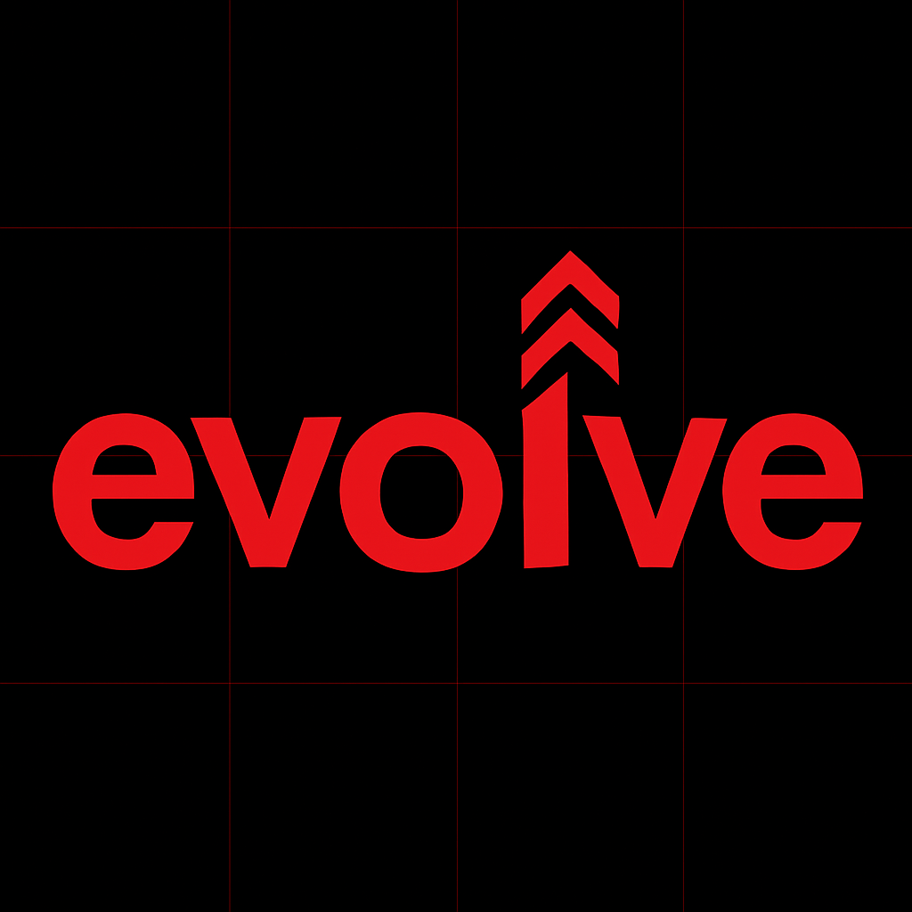
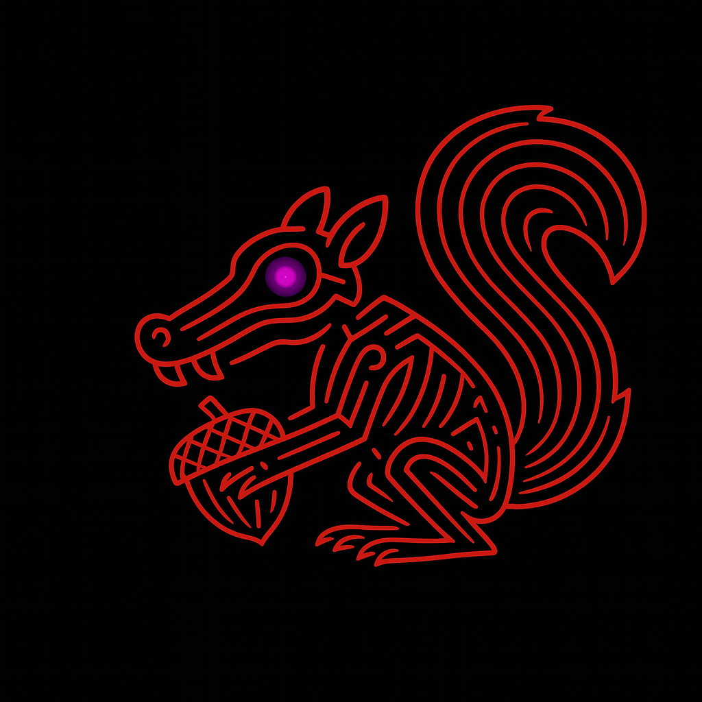
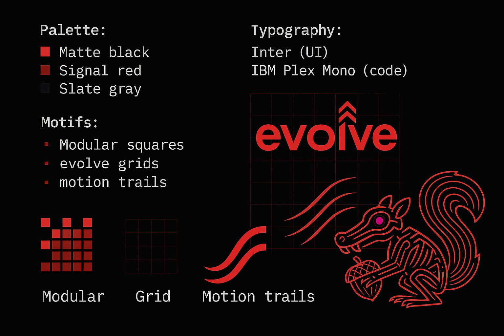

# EVOLVE: Rebrand for Rollkit

## 1. Brand Narrative

### Vision: "Launch Fast. Build Your Own Network."

Evolve is how you launch your network.

Modular. Production-ready. Yours.

Built on Celestia, Evolve enables developers a direct path to shipping custom networks — faster than standing up a full L1, and more flexible than constrained rollup frameworks.

This isn’t a toolkit. It’s a launch stack.

No fees. No middlemen. No revenue share.

Evolve is part of the unstoppable stack — a new development path where execution environments keep (evolving) improving, scaling, and adapting without limits.

—

### Strategic Positioning

**Rollups were a stopgap. Evolve is a step forward.**

Some still call them rollups. You’ll just call it your network.

Evolve reframes the conversation: these aren’t second-class layers. These are networks — with full execution freedom, developer control, and modular power.

With Evolve, you get:

- Full control over execution
- No validator ops overhead
- Speed to traction

Powered by Celestia— toward 1GB blocks, multi-VM freedom, and execution without compromising flexibility or cost.

### Why Now

Builders are choosing between:

- App-layer shortcuts
- Monolithic complexity
- Other RaaS stacks that can move fast, but often come with vendor lock-in.

Evolve gives them a fourth choice:

An open, composable, Celestia-powered framework that gets you live faster — without friction, lock-in, or architectural debt.

No token lock-ins. No extraction. No permission slips.

Just launch.

---

## 2. Naming Architecture

### Stack-Wide Renaming

| Old Name | New Name |
| --- | --- |
| Rollkit | **ev-node** |
| Lumen (reth) | **ev-reth** |
| evolve (core) | **ev-rs** |
| new client lib | **ev-client** |
| go-execution-abci | **ev-abci** |

### Naming Logic

- `ev-` = short for **Evolve** and **Execution Environment**
- Names stay descriptive
- Extensible for new modules: `ev-sdk`, `ev-stack`, `ev-tools`

---

## 3. Messaging Framework

### Master Taglines

- "Launch your own network. Evolve."
- "Rollups are over. Evolution begins."
- "Evolve networks. Built to ship."
- *"Build like an L1. Launch like an app."
- "Your execution. Your stack."
- "Escape monoliths. Exit rollups. Enter Evolve."
- "Freedom to build. Speed to launch."
- "The fastest path to your own network."
- "Execution made modular."
- "Not a toolkit. A launch protocol."
- "Infra that actually ships."
- "From devnet to production. Fast."
- "Launch infrastructure that scales with you."
- "Launch fast. Evolve endlessly."
- "Break free from rollup limits."
- “Welcome to the Evolution”
- “It’s time to Evolve”
- “The Evolution has arrived/is here.”
- “Rollups are dead. It’s time to Evolve”

### Launch Message

> "Rollkit has evolved. Introducing Evolve — a clean, modular framework for launching custom execution environments on Celestia. Faster to market, easier to customize, built to scale."
>

**Modular. Composable. Always Improving.**

Evolve is part of an unstoppable stack that gets better underneath — as Celestia scales, so does your network.

### Developer Fit Statement

Evolve is for builders who need to move fast:

- New teams launching their first network
- Existing networks migrating off legacy stacks
- New rollups designed to scale from day one
- Live rollups upgrading for lower cost, higher throughput, or more control
- New apps with user ambitions that demand their own execution
- Established apps outgrowing their infra ecosystems

You bring the vision. Evolve gives you the rails.

-

### One-Liners for Each Component

- **ev-node** — The node engine. Bring your VM, boot your network.
- **ev-reth** — An EVM built for speed. Modular, reliable.
- **ev-rs** — Rust SDK for integrating with your own network.
- **ev-abci** — Plug your Golang app logic into the stack.
- **ev-client** — Local tools to test, iterate, and launch.

---

## 4. Visual & Brand Elements

### Logo Direction (Sketch Output)

- Logotype: lowercase `evolve` in clean, geometric sans-serif
- Symbol: stacked hexagons forming an upward-pointing triangle — subtle nod to modularity and growth
- Usage: primary on dark

### Mascot (Optional)

- **Evo**: A squirrel from the Ice Age skeleton formed from layered circuit paths
- Feels more devvy than cute
- Can animate in intros/docs: The squirrel breaking ice with the acorn

### Visual Moodboard (Sketch Output)

- **Palette:**
  - Background: matte black
  - Accent: neon red, signal red
  - Secondary: slate gray, deep violet
- **Typography:** Inter (UI) + IBM Plex Mono (code)
- **Motifs:** Modular squares, evolutionary grids, motion trails
- **Design feel:** Dark-mode devtool, not SaaS

---

## 5. Launch Plan & Coordination

### ✅ Stack-Wide Rename

- [ ]  Rebrand GitHub repos
  - rollkit → `ev-node`
  - lumen → `ev-reth`
  - go-abci → `ev-abci`
  - evolve → `ev-rs`
- [ ]  Update README files, module paths
- [ ]  Refactor CI/CD where needed

### ✅ Docs & Web

- [ ]  rollkit.dev → domain options:
  - [ ]  evolvedev.xyz
  - [ ]  **evolvestack.xyz**
  - [ ]  [evolvekit.xyz](http://evolvekit.xyz)
  - [ ]  [evolvetia.xyz](http://evolvetia.xyz)
  - [ ]  3volv3.xyz
- [ ]  Replace all references to "Rollkit"
  - [ ]  Celestia
  - [ ]  Docs
    - [ ]  

        [Evolve: Build Your Own Network](https://www.notion.so/Evolve-Build-Your-Own-Network-2385777c5d0380828a4fc4cb94ca37b1?pvs=21)

  - [ ]  Partners
    - [ ]  Raas providers?
  - [ ]  
- [ ]  Simplify and restyle with new voice and tone
- [ ]  Domain decision
  - [ ]  Winning options: evolvedev

### ✅ Comms Rollout

- [ ]  Tweet thread: "Rollkit has evolved."
  - [ ]  

    [Thread Announcement](https://www.notion.so/Thread-Announcement-2385777c5d0380359e6dda21329a5041?pvs=21)

- [ ]  Blog: Rollups are dead, meet Evolve
- [ ]  Discord + Dev channels announcement
- [ ]  Partner pings

### ✅ Brand Everywhere

- [ ]  Update Celestia site mentions
- [ ]  Rename DockerHub, npm, crates, etc
- [ ]  Revise Discord server name/icon
- [ ]  Swap out logos and favicon assets

---

## 6. Appendix

### Messaging Do's & Don'ts

- ✅ Do say: "Your network. Your execution."
- ✅ Do say: "Modular, open, ready"
- ✅ Do say: "Build fast. Launch free."
- ❌ Don't say: "Rollup,” “Layer 2,” or “easy alternative”
- ❌ Don't criticize RaaS partners — emphasize optionality and openness

### Sample Voice Elements

- *"You bring the logic. We bring the rails."*
- *"Swap the VM. Keep the speed."*
- *"Evolve isn’t a toolkit. It’s a launch protocol."*
- *"Backed by Celestia. Powered by you."*
- *"Build like a chain. Ship like a startup."*

---

## Final Word

Evolve is more than a rebrand. It’s a reframing.

From Rollkit to ev-node, execution frameworks have changed.

This is how modular networks launch now.

**Launch your network. Build without compromise. Welcome to Evolve.**
